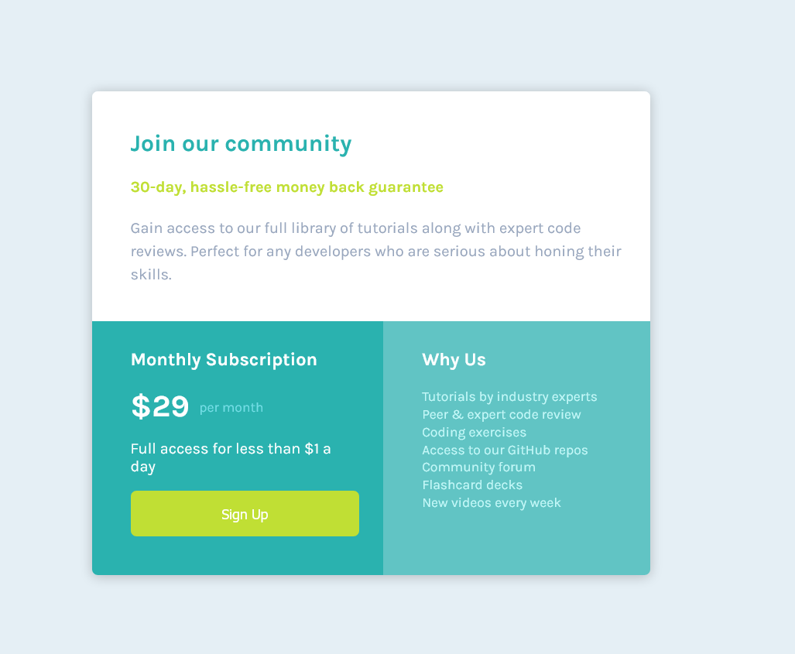
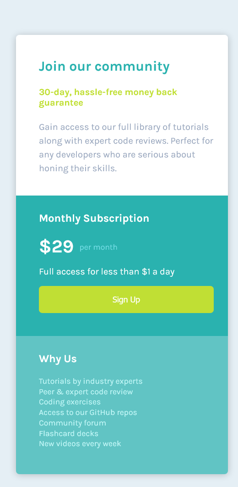

# Frontend Mentor - Single price grid component solution

This is a solution to the [Single price grid component challenge on Frontend Mentor](https://www.frontendmentor.io/challenges/single-price-grid-component-5ce41129d0ff452fec5abbbc). Frontend Mentor challenges help you improve your coding skills by building realistic projects. 

## Table of contents

- [Overview](#overview)
  - [The challenge](#the-challenge)
  - [Screenshot](#screenshot)
  - [Links](#links)
- [My process](#my-process)
  - [Built with](#built-with)
  - [What I learned](#what-i-learned)
  - [Useful resources](#useful-resources)
- [Author](#author)


## Overview

### The challenge

Users should be able to:

- View the optimal layout for the component depending on their device's screen size
- See a hover state on desktop for the Sign Up call-to-action

### Screenshot





### Links

- [Solution URL](https://github.com/rahul0923/single-price-grid-component-master)
- [Live Site URL](https://rahul0923.github.io/single-price-grid-component-master/)

## My process

### Built with

- Semantic HTML5 markup
- BEM notation for CSS
- Flexbox
- Mobile-first workflow


### What I learned

Use this section to recap over some of your major learnings while working through this project. Writing these out and providing code samples of areas you want to highlight is a great way to reinforce your own knowledge.

To see how you can add code snippets, see below:

```html
Usage of symantic html like
<main>
    <div>
        <section></section>
    </div>
</main>
```
```css
.subscription-info {  
  flex: 1;
  background: hsl(179, 62%, 43%);
  padding-left: 40px;
  padding-right: 25px;
  padding-top: 10px;
  padding-bottom: 40px;
}

.join-info {
  flex: 1;
  background: hsl(179, 62%, 43%, 0.7);
  padding-left: 40px;
  padding-top: 10px;
  padding-bottom: 30px;
}
```


### Useful resources

- [Example resource 1](http://getbem.com/introduction/) - This helped me understand how to use BEM format for my css classes

## Author

- Website - [Add your name here](https://www.your-site.com)
- Frontend Mentor - [@yourusername](https://www.frontendmentor.io/profile/yourusername)

